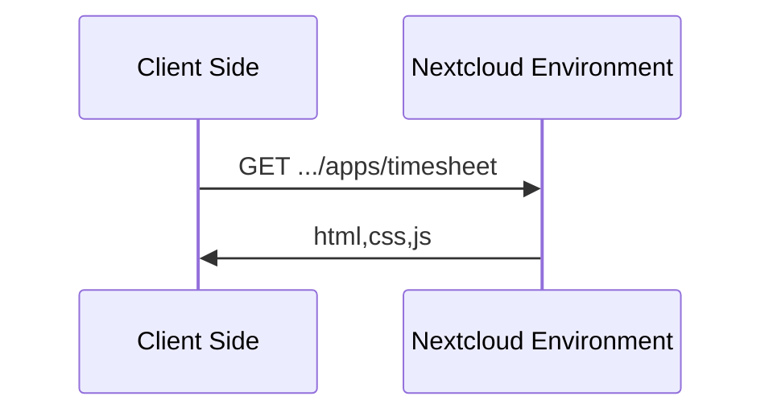
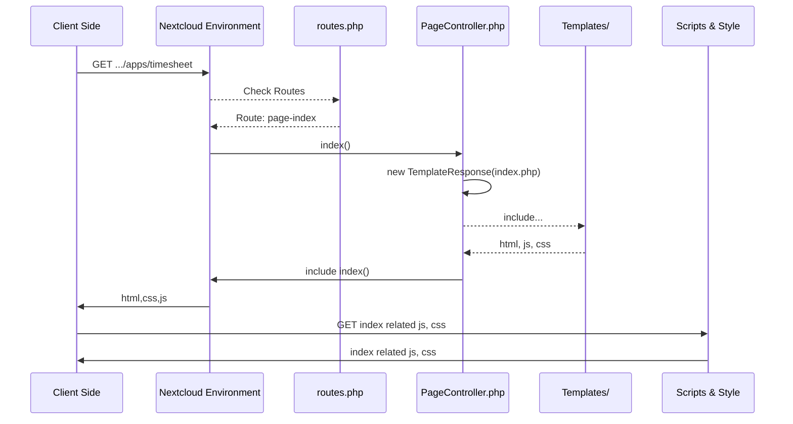
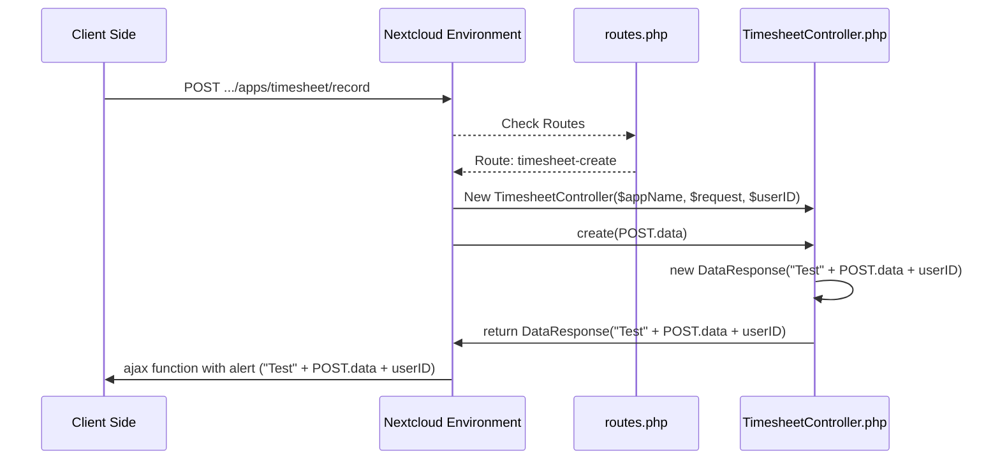
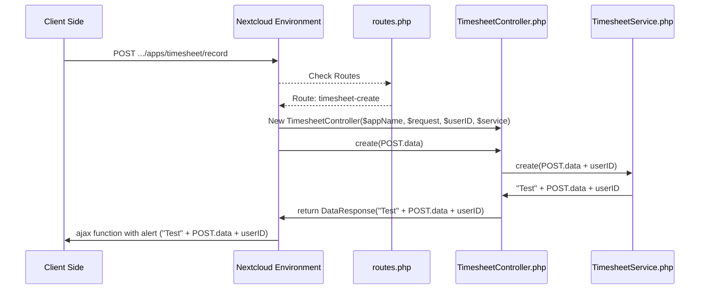
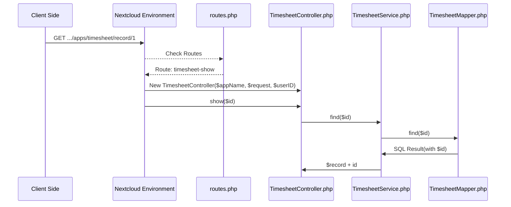

## App Info

Routes:

On the server side we need to register a callback that is executed once the request comes in. The callback itself will be a method on a controller and the controller will be connected to the URL with a route. The controller and route for the page are already set up in /appinfo/routes.php:

## Client side

Folders:
* \css - Style Sheets
* \img - Images (App Icon)
* \js - javascripts

## Server side
php scripts located at \lib and html stuff located at \templates

* \lib\Controller
* \templates\Controller

## How calls are executed

Client side request nextcloud app and server side answers with all client side data. The GET method requests a representation of the specified resource. Requests using GET should only retrieve data and should have no other effect. 

However, as app developer the nextcloud server answers with more data, like login, theme etc (huge framework). To simplify it, we can approximate the app call with

Nextcloud environment checkes the routes list located at routes.php. If the index (toplevel) is called, it will check if the index (`['name' => 'page#index', 'url' => '/', 'verb' => 'GET'],`) is defined and returned to environment. As visible, the index is defined at the PageController with function index.  Now the environment requests the index function in PageController.php, which then will return its content. This is defined in the index funtion, here it is a template response of index.php, which is then embedded in the nextcloud framework for client side.

What happens with a POST request? The POST request method requests that a server accepts the data enclosed in the body of the request message, most likely for storing it.

From client side, we are going to request the ressource `record`. This the routes will be checked again. Now it is the TimesheetController with create function, which returns the POST request's data and some static text, which is then display using the ajax request. The content is introduced from the `AppFramework\Controller` class and the DataReponse at `AppFramework\Http\DataReponse`. The Controller function needs the security checks `@NoAdminRequired` and all parameters should be defined. The controller is constructed using the AppName, request and (optional) userID.

Next, we want to save the data. The simplest way is to use the TimesheetController directly. This can lead to some problems, if the database is changed later. So it makes sense to use a seperate service, called `TimesheetService.php`, which handels the database connection and transfer.

Now, we want to save it. Therefore we need a database, see (https://docs.nextcloud.com/server/17/developer_manual/app/tutorial.html#database) For migration, change the version number and nextcloud will migrate the database. This migration is done using `Migration/Record.php`, which generates a database. A `RecordMapper.php` will maps entities into the database. The parent class of RecordMapper provides insert and update functions.

Now read the data using GET.
